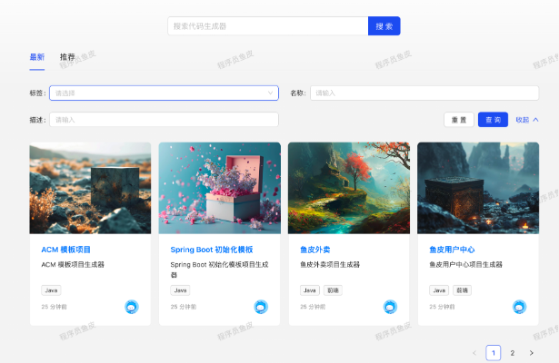
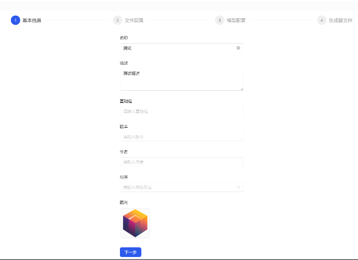
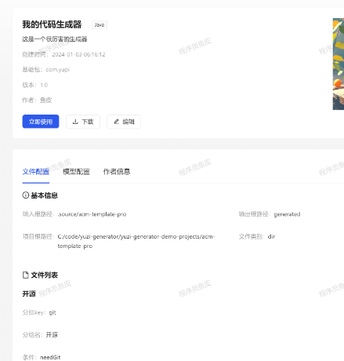
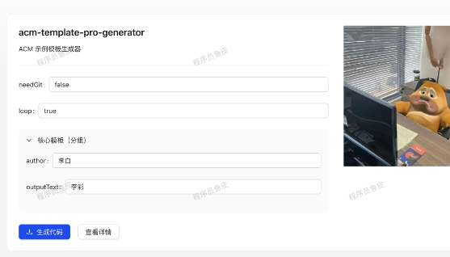

# 代码生成器平台

深入业务场景的企业级硬项目，基于 React + Spring Boot + Picocli + 对象存储的 **代码生成器共享平台** 。

开发者可以在平台上制作并发布代码生成器，用户可以搜索、下载、在线使用代码生成器，管理员可以集中管理所有用户和生成器。

#### 项目展示

主页（代码生成器搜索列表）：

代码生成器创建页（分步表单）：

代码生成器创建页（复杂嵌套动态表单）：

.png)

在线上传和制作代码生成器：

代码生成器详情页：

在线使用代码生成器：

### 技术选型 

#### 后端

- Java Spring Boot 
- MySQL 数据库
- MyBatis-Plus 及 MyBatis X 自动生成
- Maven 自动打包
- ⭐️ Picocli Java 命令行应用开发
- ⭐️ FreeMarker 模板引擎
- ⭐️ Caffeine + Redis 多级缓存
- ⭐️ XXL-JOB 分布式任务调度系统
- ⭐️ 腾讯云 COS 对象存储
- ⭐️ 多种设计模式
  - 命令模式
  - 模板方法模式
  - 双检锁单例模式
- Hutool 工具库和 Lambda 表达式编程

